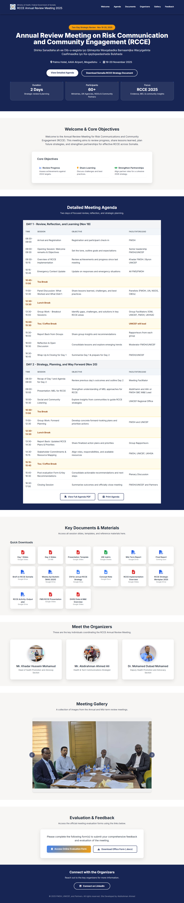

# FMoH Somalia - RCCE Annual Review Meeting 2025 Website

This repository contains the source code for the official website of the **Annual Review Meeting on Risk Communication and Community Engagement (RCCE)**, hosted by the Federal Ministry of Health, Somalia.

The website serves as a central hub for meeting attendees, providing access to the agenda, key documents, organizer information, and post-event resources.

## Features

-   **Responsive Design**: Fully accessible on desktop, tablet, and mobile devices.
-   **Interactive Agenda**: A detailed, easy-to-read schedule for the two-day event.
-   **Document Hub**: Centralized access to presentations, reports, and templates.
-   **Image Gallery**: A slideshow of photos from the meeting.
-   **Sticky Header & Scrollspy**: Smooth navigation that highlights the user's current section.
-   **Print-Friendly**: The agenda can be easily printed for offline use.

## Live Demo

The website is hosted using GitHub Pages and can be viewed live at:

**[https://maankakpp.github.io/FMoH-Somalia-RCCE-Annual-Meeting-2025/](https://maankakpp.github.io/FMoH-Somalia-RCCE-Annual-Meeting-2025/)**

## Technologies Used

-   HTML5
-   CSS3 (with Tailwind CSS for utility classes)
-   JavaScript (for interactivity like the gallery, lightbox, and scroll effects)
-   Font Awesome (for icons)
-   Google Fonts (for typography)

---

*This site was developed by Abdirahman Ahmed.*